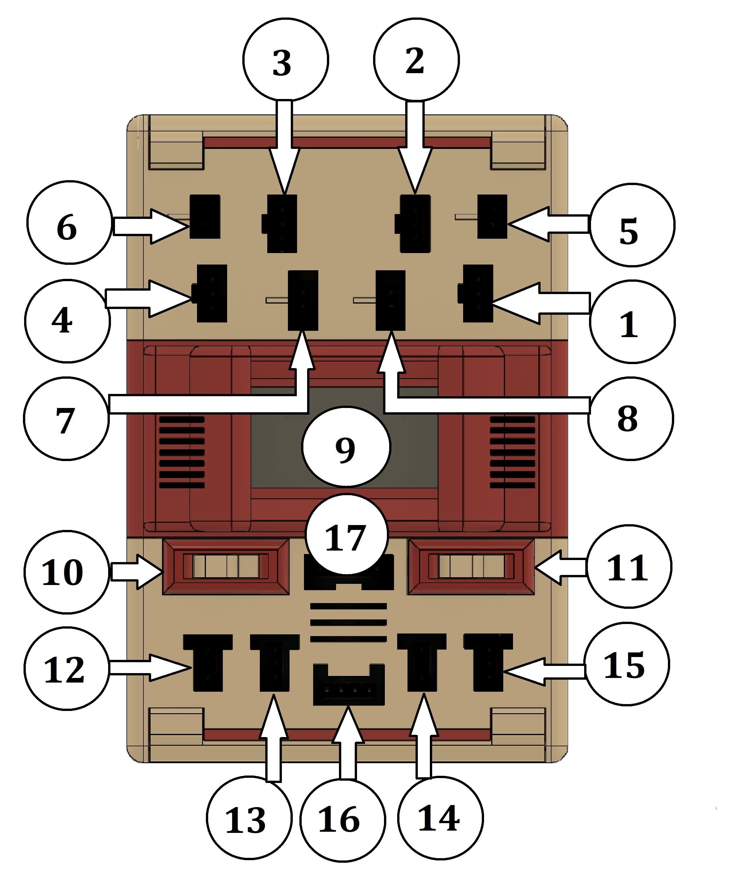
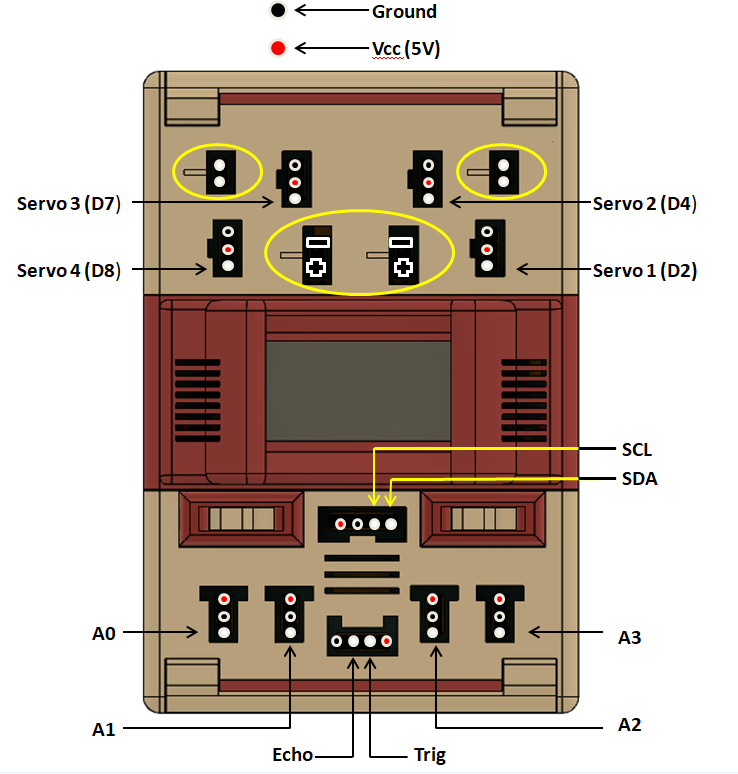

# Odysseus (Ody) Educational Robotics Kit

## Summary
This repository contains the open-source hardware and software for **Odysseus (Ody)**, a new educational robotics kit designed to teach programming, algorithms, and data structures to learners of all ages.  

Ody is built from inexpensive hardware and open-source software, giving users maximum flexibility. Its plastic components can be 3D-printed at home, while custom electronic parts—designed specifically for the kit—are freely accessible and open for modification. Unlike fixed-form robots, Ody adopts a **modular approach**: electronic units are enclosed in plastic casings that can be combined to build robots of various forms, such as cars, humanoids, or robotic arms.  

Safety is ensured by design, preventing short circuits or other failures. The programming environment integrates specialized commands tailored to different learning levels.  

This project complies with the [Open Source Hardware Definition 1.0 (OSHWA)](https://oshwa.org/resources/open-source-hardware-definition/) and is fully reproducible.

---

## Hardware Overview
- **Bill of Materials (BOM):** A detailed list of all required components and estimated costs can be found in the [BOM.md](BOM.md) file.
- **Hardware Files:** PCB design files, images, CAD files, and STL files for plastic parts are provided in the `/hardware` folder.  The hardware architecture is described in [hardware_architecture.md](Hardware/hardware_architecture.md)

Hardware can be built using available components and standard processes.

### Physical Appearance

  
   
  <em>Figure 1: Top view of the Odysseus (Ody) programmable robotic platform.</em>

 

The top view of the programmable component measures **11.8 × 8 × 4.2 cm**.  

- **Upper side outputs:** Motors and LEDs  
  - Slots 1–4: Servos  
  - Slots 5–6: DC motors  
  - Slots 7–8: LEDs  
- **Opposite side inputs:** Sensors  
  - Slots 12–15: 3-pin sensors  
  - Slot 16: Ultrasonic sensor  
  - Slot 17: Color sensor or any I2C sensor  
- **Middle components:** OLED display (9), Power switch (10), Bluetooth switch (11)

### Pinout
Figure 2 illustrates the pin-out layout and connection interfaces for actuators and sensors. We used the symbols
’+’ and ’−’ to denote the LED’s Anode and Cathode terminals, respectively.

All plug housings (except the ones shown in yellow ellipses) enforce a specific orientation, physically preventing insertion into incorrect ports or reverse polarity connections. The sockets for DC motors and LEDs (shown in yellow ellipses) are non-destructive upon reverse insertion. For DC motors, incorrect polarity simply results in reversed rotation. To assist the user, visual alignment markers were added to both the programmable component and the plug; once the correct cable orientation is determined, the plug is finalized so that these markers guide future connections. Similarly, reversing the connection of an LED results only in a failure to illuminate, without causing damage. In both cases, the user can easily rectify the orientation based on the visual clues provided.

  
   
  <em>Figure 2: Top of the programmable component illustrating the pinout layout and connection interfaces for
actuators and sensors..</em>

 

---

## Software / Firmware
Source code is located in `/software`. The software includes:  
- Arduino firmware (libraries included)  
- ATtiny85 firmware (libraries included)

Further description of the firmware can be found in [firmware.md](software/firmware.md).

### Programming Tools
Ody can be programmed using **[Snap4Arduino](https://snap4arduino.rocks/)** or **Python**. The command codes can be found in [command_codes.md](Programming%20tools/command_codes.md).
- Snap4Arduino block commands matching Ody's architecture are included in [block_commands.md](Programming%20tools/Snap4Arduino/block_commands.md).
- Python code for programming Ody is presented in [python.md](Programming%20tools/Python/python.md)

A complete programming course exists on YouTube. The name of the course is "Programming (with) Ody". 

<strong>📺 Click to expand the list of YouTube Lessons</strong>

- [Programming (with) Ody: lesson 1](https://youtu.be/KiOrB0-xSgk)
- [Programming (with) Ody: lesson 2](https://youtu.be/X_hxR9N5-oY)
- [Programming (with) Ody: lesson 3](https://youtu.be/mXWZ1vFPjeE)
- [Programming (with) Ody: lesson 4](https://youtu.be/Cjcx91HtwfY)
- [Programming (with) Ody: lesson 5](https://youtu.be/sCMt8lUhTYI)
- [Programming (with) Ody: lesson 6](https://youtu.be/-BYgygAJRaI)
- [Programming (with) Ody: lesson 7](https://youtu.be/BNSvz-b1BRc)
- [Programming (with) Ody: lesson 8](https://youtu.be/mb39kOAdF4A)

---

### Plastic Parts and Assembly
A guide on how to assemble the programming component is included in [plastic parts and assembly.md](<Hardware/plastic_parts/plastic_parts_and_assembly.md>)

## Licensing
- **Hardware:** CERN Open Hardware Licence Version 2 - Strongly Reciprocal (CERN-OHL-S v2.0).
- **Software (Arduino/ATtiny):** GNU General Public License v3.0 (GPLv3).
- **Software (Python API):** Apache License 2.0.

This ensures that Odysseus remains freely available for educational purposes and that any future modifications by third parties are shared back with the open-source community under the same terms.