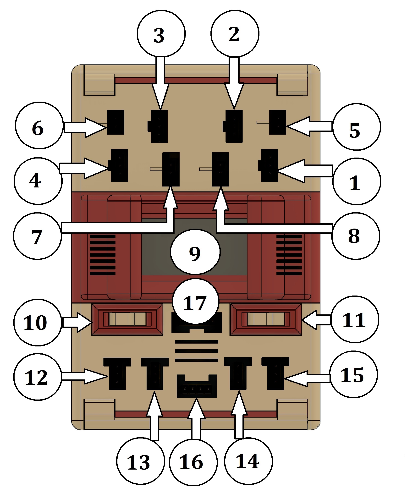

# Odysseus (Ody) Educational Robotics Kit

## Summary
This repository contains the open-source hardware and software for **Odysseus (Ody)**, a new educational robotics kit designed to teach programming, algorithms, and data structures to learners of all ages.  

Ody is built from inexpensive hardware and open-source software, giving users maximum flexibility. Its plastic components can be 3D-printed at home, while custom electronic parts—designed specifically for the kit—are freely accessible and open for modification. Unlike fixed-form robots, Ody adopts a **modular approach**: electronic units are enclosed in plastic casings that can be combined to build robots of various forms, such as cars, humanoids, or robotic arms.  

Safety is ensured by design, preventing short circuits or other failures. The programming environment integrates specialized commands tailored to different learning levels.  

This project complies with the **Open Source Hardware Definition 1.0 (OSHWA)** and is fully reproducible.

---

## Hardware Overview
- PCB design files, images, CAD files, and STL files for plastic parts are provided in the `/hardware` folder.  
- Hardware can be built using readily-available components and standard processes.

### Physical Appearance
  
The top view of the programmable component measures **11.8 × 8 × 4.2 cm**.  

- Upper side outputs: motors and LEDs  
  - Slots 1–4: servos  
  - Slots 5–6: DC motors  
  - Slots 7–8: LEDs  
- Opposite side inputs: sensors  
  - Slots 12–15: 3-pin sensors  
  - Slot 16: ultrasonic sensor  
  - Slot 17: color sensor or any I2C sensor  
- Middle components: OLED display (9), power switch (10), Bluetooth switch (11)

---

## Software / Firmware
Source code is located in `/software`. The software includes:  
- Arduino firmware (libraries included)  
- ATtiny85 firmware (libraries included)  

### Programming Tools
Ody can be programmed using **Snap4Arduino** or **Python**. Snap4Arduino block commands matching Ody's architecture are included. Python support will be released soon. A programming course exists on Youtube. The name of the course is Programming (with) Ody". The links for the lessons are:
- [Programming (with) Ody: lesson 1](https://youtu.be/KiOrB0-xSgk)
- [Programming (with) Ody: lesson 2](https://youtu.be/X_hxR9N5-oY)
- [Programming (with) Ody: lesson 3](https://youtu.be/mXWZ1vFPjeE)
- [Programming (with) Ody: lesson 4](https://youtu.be/Cjcx91HtwfY)
- [Programming (with) Ody: lesson 5](https://youtu.be/sCMt8lUhTYI)
- [Programming (with) Ody: lesson 6](https://youtu.be/-BYgygAJRaI)
- [Programming (with) Ody: lesson 7](https://youtu.be/BNSvz-b1BRc)
- [Programming (with) Ody: lesson 8](https://youtu.be/mb39kOAdF4A)

---

## Bill of Materials (BOM)

The following table lists materials needed for **20 programmable components**. Prices are from AliExpress (shipping not included):

| Part Name | Quantity | Price (Euros) | Label/Position |
|-----------|---------|---------------|----------------|
| SN74LVC1G32DBVR SOT23-5 (OR gates) | 20 | 1,46 | OG |
| NE555 SOP-8 IC Timer | 20 | 1,52 | NT |
| 50V1UF SMD Electrolytic Capacitor 50V1UF | 20 | 1,6 | C5 |
| SS-22F15 toggle 15.5×7.5 Two gears six feet Dual-row in-line sliding power switch | 20 | 6,3 |  |
| MX1508 SOP16 | 20 | 3,8 | MX1508 |
| SMD Diode 1N5819 SOD 123 | 100 (80 needed) | 0,81 | D1, D2, D3, D4 |
| SMD Electrolytic Capacitor 10V47UF(4X5.4) | 80 | 5,6 | C1, C2, C3, C4 |
| 7805 5V 1.5A TO-252 Voltage Regulators | 40 | 10 | VR1, VR2 |
| SMD Buzzer 9650 (9,6 × 9,6 × 5) | 20 | 5,2 | BUZ |
| SS12D10 Toggle Switch 3Pins Straight Feet 1P2T Handle | 20 | 1,8 |  |
| IRF4905S TO263 | 20 | 5,4 | MOSFET |
| SN74LVC2G66 VSSOP-8 | 20 | 3,6 | BS |
| OLED Display Module SH1106 128×64 1.3 inch I2C | 20 | 30 |  |
| ATtiny85-20PU DIP-8 | 20 | 80 |  |
| 2.54MM 8 Pin DIP-8 IC Sockets Adapter | 20 | 1 |  |
| 1206 SMD LED Red | 100 (20 needed) | 0,51 | Left side, above power switch |
| 1206 SMD LED Blue | 100 (20 needed) | 0,51 | Right side, above Bluetooth switch |
| 150 Ohm 1206 SMD Resistors | 100 (40 needed) | 0,63 | R13, R18 |
| 220 Ohm 1206 SMD Resistors | 200 (120 needed) | 1,26 | R5, R6, R7, R8, R20, R21 |
| 4.3kΩ 1206 SMD Resistors | 100 (80 needed) | 0,63 | R1, R2, R3, R4 |
| 100 kΩ 1206 SMD Resistors | 200 (140 needed) | 1,26 | R9, R10, R11, R12, R16, R17, R19 |
| 470 kΩ 1206 SMD Resistors | 100 (20 needed) | 0,63 | R15 |
| 330Ω 1206 SMD Resistors | 100 (20 needed) | 0,63 | R14 |
| PCBs | 20 | 80 |  |
| Stencil | 1 | 10 |  |
| Male 2.54mm Breakable Pin Headers | 40×40 | 7 |  |
| Single Row 4-Pin Female Header Socket | 20 | 1,2 |  |
| Round Hole Pin Header 2.0/2.54mm Female | 5 (3 needed) | 3,07 |  |
| Round Hole Pin Header 2.0/2.54mm Male | 5 (3 needed) | 3,07 |  |
| 10 Spring Contact Sheet Battery Box | 4 (2 per shield) | 6,28 |  |
| 18650 Batteries | 40 (per shield) | 200 |  |
| Arduino Uno R3 ATMEGA 328P | 20 | 57,6 |  |
| Solder paste | | |  |
| Plastic pin connectors | | |  |

---

## STL Files

| STL File Name | Quantity |
|---------------|---------|
| bottom | 1 |
| Mid | 1 |
| top-motors | 1 |
| top-monitor | 1 |
| top-sensors | 1 |
| door | 2 |
| side-cover | 1 |
| switch-middle | 2 |
| Switch-top-power | 1 |
| Switch-top-bluetooth | 1 |

> **Note:** Print STL files with proper 3D printer calibration. Adjust **E-steps/mm** using the “brick_joint_test.stl” to ensure parts fit properly. Except for `top-monitor`, no supports are needed.

---

## Assembly Instructions

1. **Prepare PCB**: Manufacture using `/hardware/PCB files`.  
2. **Print Plastic Parts**: Follow STL files above.  
3. **Assemble Programmable Component**: the steps are shown in the following picture
 

A video of the assembling procedure can be found in:
- [Assembling Ody](https://youtu.be/fEAzW5WLRD8)

4. **Upload Firmware / Software**: Follow instructions in `/software`.

---

## Licensing
- **Hardware**: CERN Open Hardware License v2 – Permissive (CERN-OHL-P).  
- **Software**: MIT License. 

--- 
